# Outline

.pull-left[

### 1. Context
### 2. Aims
### 3. Results
### 4. Conclusions

]

.pull-right[

.center[

]

]

---

class: inverse, center, middle
<html><div style='float:left'></div><hr color='#f38620' size=1px width=720px></html> 

# CONTEXT

---

# What’s Metabolomics?

_"Metabolomics is the identification and quantification of the small molecule metabolic products (the metabolome) of a biological system. Mass spectrometry and NMR spectroscopy are the techniques most often used for metabolome profiling"<sup>1</sup>_

## _"The Omics Cascade"_

.center[
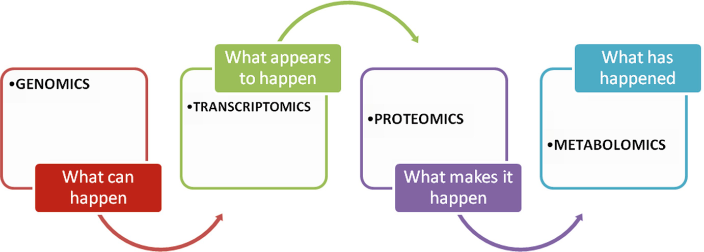<sup>2</sup>
]

.footnote[
[1] https://www.nature.com/subjects/metabolomics

[2] Narad P., Kirthanashri S.V. (2018) Introduction to Omics. In: Arivaradarajan P., Misra G. (eds) Omics Approaches, Technologies And Applications. Springer, Singapore
]
  
---

# Freely Available Existing Tools

.pull-left[

```{r, warning = FALSE, comment = NA, message = FALSE, echo = FALSE, dpi = 200}
library(ggplot2)
tools <- readxl::read_excel("tools.xlsx")
ggplot(tools, aes(class, ..count..)) +
  geom_bar(aes(fill = type), position = "dodge") +
  xlab("") +
  ylab("Number of tools") +
  theme_bw() +
  theme(legend.title = element_blank(),
        legend.text = element_text(size = 18),
        axis.text = element_text(size = 16),
        axis.title = element_text(size = 20),
        legend.position = "top")
```

]

.pull-right[

#### Web app tools that include statistical analysis options<sup>3</sup>

  - Workflow4Metabolomics 
  - Galaxy-M
  - XCMS 
  - MetaboAnalyst

#### Drawbacks

  - Few statistical methods available
  - Covariates
  - Interoperability and reproducibility
]

.footnote[

[3] Spicer, R., Salek, R. M., Moreno, P., Cañueto, D., & Steinbeck, C. (2017). Navigating freely-available software tools for metabolomics analysis. Metabolomics, 13(9), 106.

]

---

class: inverse, center, middle
<html><div style='float:left'></div><hr color='#f38620' size=1px width=720px></html> 

# AIMS

---

#  Aims

.font110[
  - Provide users of an <span style="color:#f38620">**user-friendly**</span> and <span style="color:#f38620">**intuitive**</span> tool
  ]

.font110[
  - Allow users to include <span style="color:#f38620">**covariates**</span> in the analysis     
  ]
  
.font110[
  - Provide users <span style="color:#f38620">**alternative statistical methodologies**</span> for mass spectrometry data analysis    
  ]
  
.font110[
  - Provide a fully <span style="color:#f38620">**reproducible**</span> and <span style="color:#f38620">**transparent**</span> tool      
  
      - Open Source     
      - R/**<span style="color:#f38620">Bioconductor</span>** package
    ]
    
.font110[
  - **Create a web app tool <span style="color:#f38620">not to substitute</span> powerful and robust tools that already exist but an <span style="color:#f38620">user-friendly and intuitive alternative</span> that addresses some of the issues not covered by the other tools**
  ]
  
---

class: inverse, center, middle
<html><div style='float:left'></div><hr color='#f38620' size=1px width=720px></html> 

# RESULTS

---

# POMAShiny App

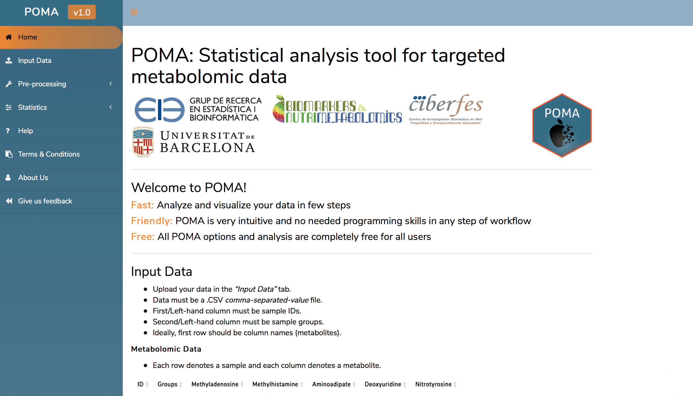

<a href="https://github.com/pcastellanoescuder/POMAShiny"><i class="fab fa-github"></i>&nbsp; https://github.com/pcastellanoescuder/POMAShiny</a><br>

---

# POMAShiny Workflow

.center[
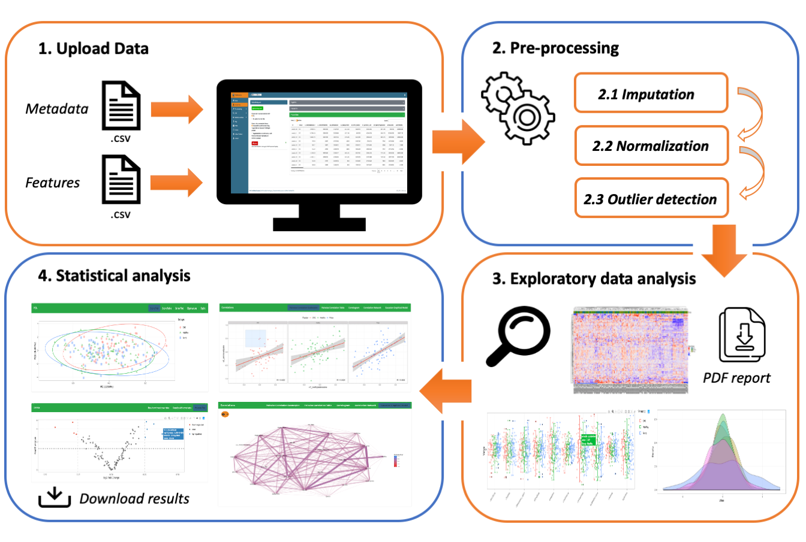
]

<a href="https://github.com/pcastellanoescuder/POMAShiny"><i class="fab fa-github"></i>&nbsp; https://github.com/pcastellanoescuder/POMAShiny</a><br>

---

# Architecture

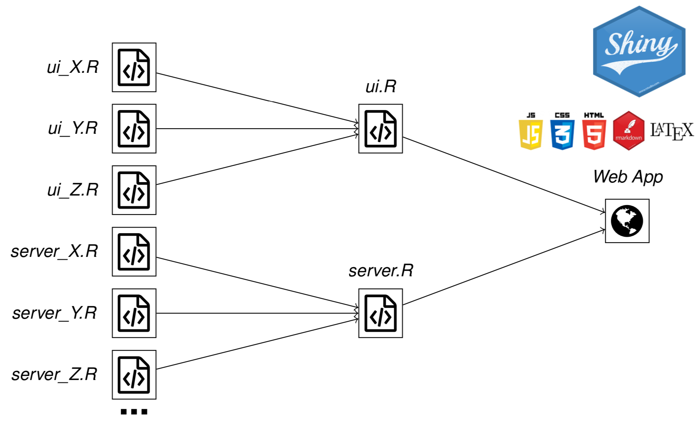

---

# Upload Data Panel

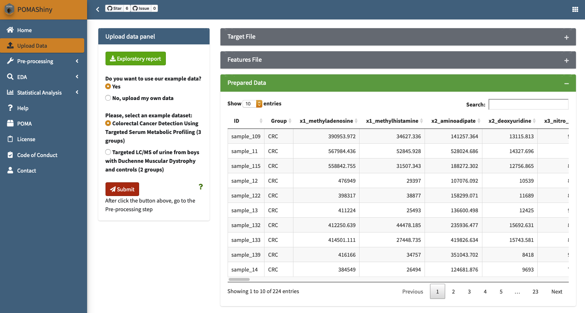
<a href="https://github.com/pcastellanoescuder/POMAShiny"><i class="fab fa-github"></i>&nbsp; https://github.com/pcastellanoescuder/POMAShiny</a><br>

---

# Upload Data Panel

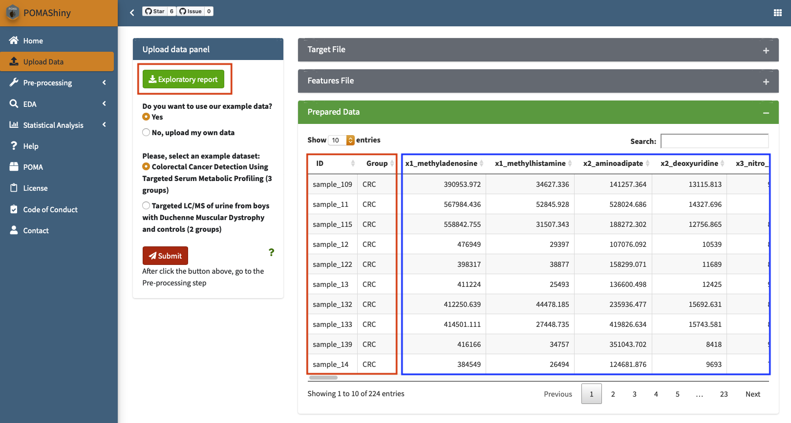
<a href="https://github.com/pcastellanoescuder/POMAShiny"><i class="fab fa-github"></i>&nbsp; https://github.com/pcastellanoescuder/POMAShiny</a><br>

---

# Interactive Visualization

  .center[
    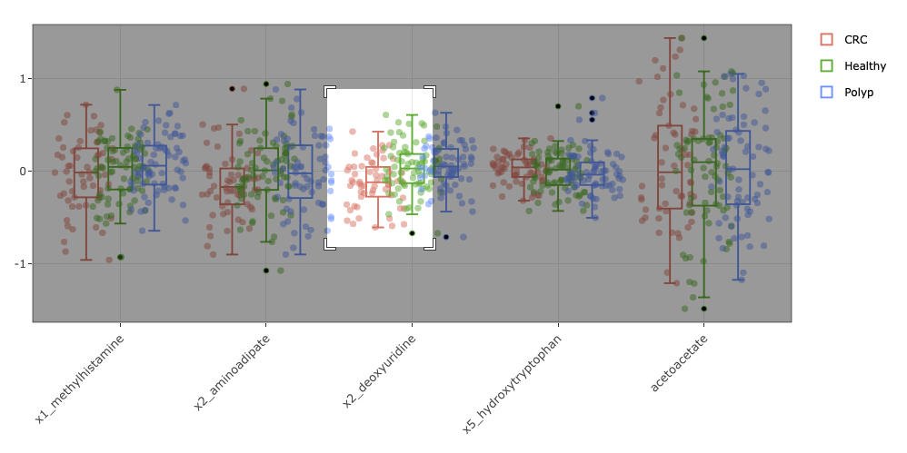
  ]

  .center[
    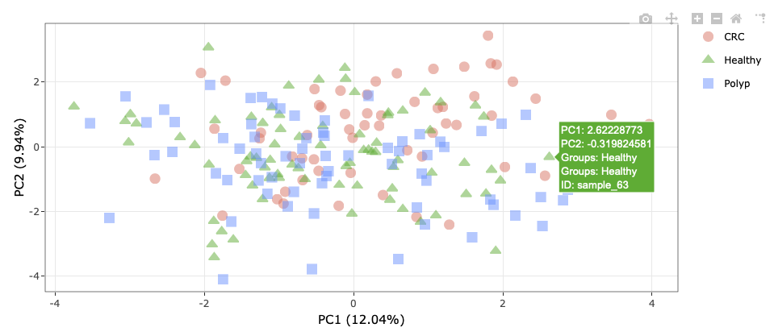
  ]

---

# Help & Documentation

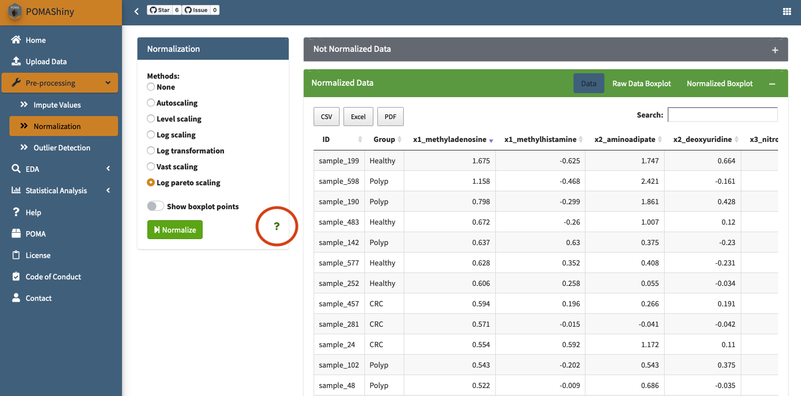
<a href="https://github.com/pcastellanoescuder/POMAShiny"><i class="fab fa-github"></i>&nbsp; https://github.com/pcastellanoescuder/POMAShiny</a><br>

---

# Help & Documentation

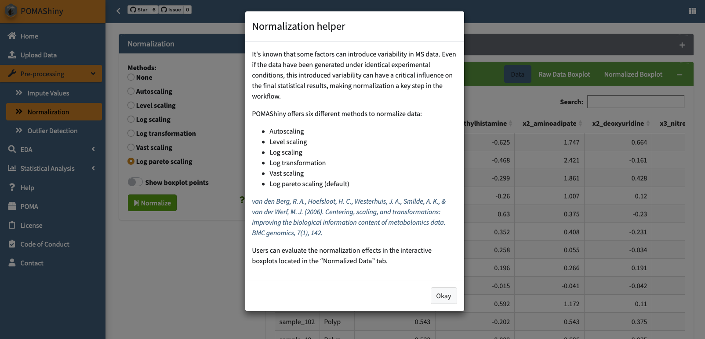
<a href="https://github.com/pcastellanoescuder/POMAShiny"><i class="fab fa-github"></i>&nbsp; https://github.com/pcastellanoescuder/POMAShiny</a><br>

---

# Statistical Analysis

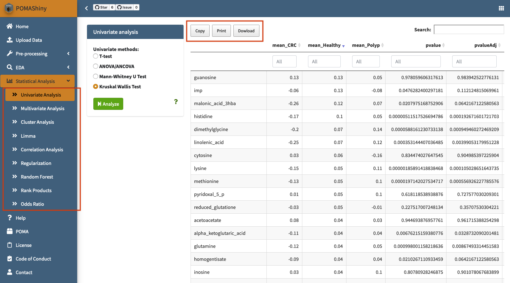
<a href="https://github.com/pcastellanoescuder/POMAShiny"><i class="fab fa-github"></i>&nbsp; https://github.com/pcastellanoescuder/POMAShiny</a><br>

---

# Prediction Models in POMAShiny

  - Test set
  - External validation
  - Real prediction metrics
  
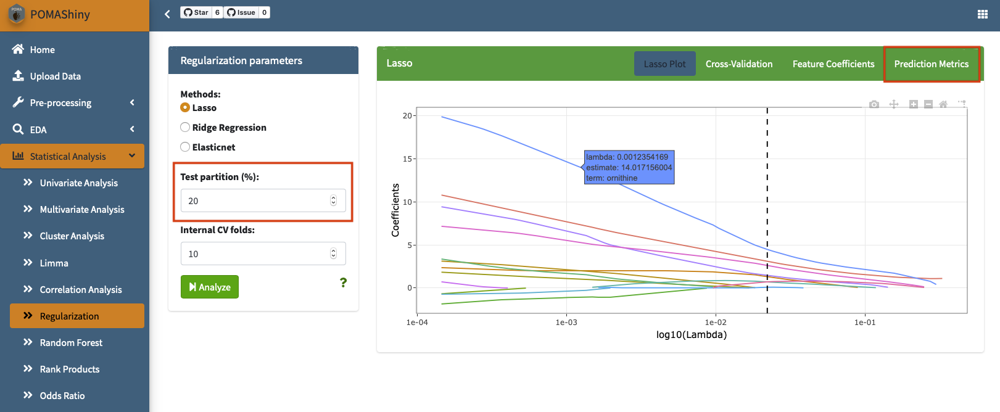
<a href="https://github.com/pcastellanoescuder/POMAShiny"><i class="fab fa-github"></i>&nbsp; https://github.com/pcastellanoescuder/POMAShiny</a><br>

---

# POMA Package

## `POMA` package will become part of Bioconductor version 3.12 on October 28th, 2020 `r emo::ji("tada")` 

<a href="https://github.com/pcastellanoescuder/POMA"><i class="fab fa-github"></i>&nbsp; https://github.com/pcastellanoescuder/POMA</a><br>

.pull-left[

  .center[
    
  ]
]

.pull-right[

  .center[
    
  ]
]
---

class: inverse, center, middle
<html><div style='float:left'></div><hr color='#f38620' size=1px width=720px></html> 

# CONCLUSIONS

---

# Conclusions

.font110[
  - POMAShiny is a web-app tool powered by <span style="color:#f38620">**Shiny**</span> framework and <span style="color:#f38620">**POMA**</span> Bioconductor package
  ]
  
.font110[
  - POMAShiny provides several statistical methods for mass spectrometry statistical analysis in a <span style="color:#f38620">**comfortable**</span>, <span style="color:#f38620">**interactive**</span> and <span style="color:#f38620">**user-friendly**</span> environment 
  ]
  
.font110[
  - POMAShiny allows users to include different <span style="color:#f38620">**covariates**</span> in the analysis
  ]

.font110[  
  - The joint existence of both POMA package and POMAShiny web interface becomes a huge increase in the <span style="color:#f38620">**reproducibility**</span> and <span style="color:#f38620">**transparency**</span> of the analysis
  ]
  
.font110[
  - POMAShiny and POMA are both <span style="color:#f38620">**open source**</span> projects and everybody is <span style="color:#f38620">**welcome to contribute!**</span>
  ]

---

class: inverse, center, middle

# Thank you all!

**[Statistics and Bioinformatics Research Group](https://sites.google.com/view/estbioinfo/home)** <span style="color:#ffffff">and</span> **[Biomarkers and Nutritional & Food Metabolomics Research Group](http://www.nutrimetabolomics.com/)** <span style="color:#ffffff">from</span> **[University of Barcelona](https://www.ub.edu/web/ub/en/index.html?)**      

<span style="color:#ffffff">Slides available at</span> [https://github.com/pcastellanoescuder/POMAShiny_slides_BioCAsia2020](https://github.com/pcastellanoescuder/POMAShiny_slides_BioCAsia2020)

<html><div style='float:left'></div><hr color='#f38620' size=1px width=720px></html> 

<a href="mailto:polcaes@gmail.com"><i class="fas fa-envelope"></i>&nbsp; polcaes@gmail.com</a><br>
<a href="https://pcastellanoescuder.github.io/"><i class="fas fa-link"></i>&nbsp; pcastellanoescuder.github.io/</a><br>
<a href="http://twitter.com/polcastellano_"><i class="fab fa-twitter"></i>&nbsp; @polcastellano_</a><br>
<a href="https://github.com/pcastellanoescuder"><i class="fab fa-github"></i>&nbsp; @pcastellanoescuder</a><br>
<a href="https://www.ub.edu/web/ub/en/index.html?"><i class="fas fa-map-marker-alt"></i>&nbsp; University of Barcelona</a>

